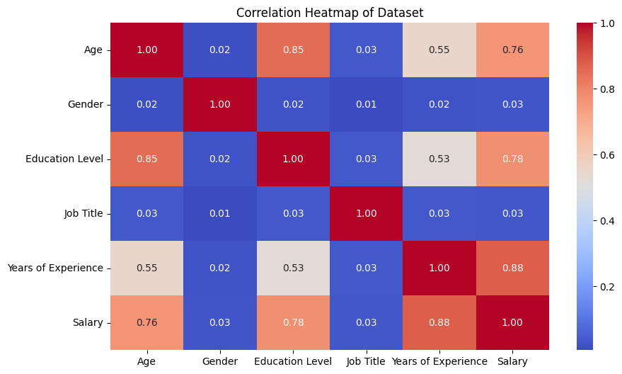
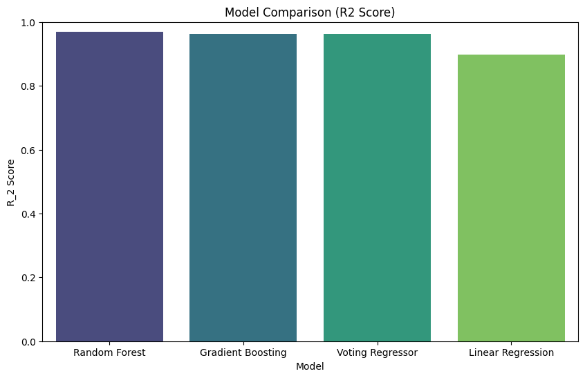
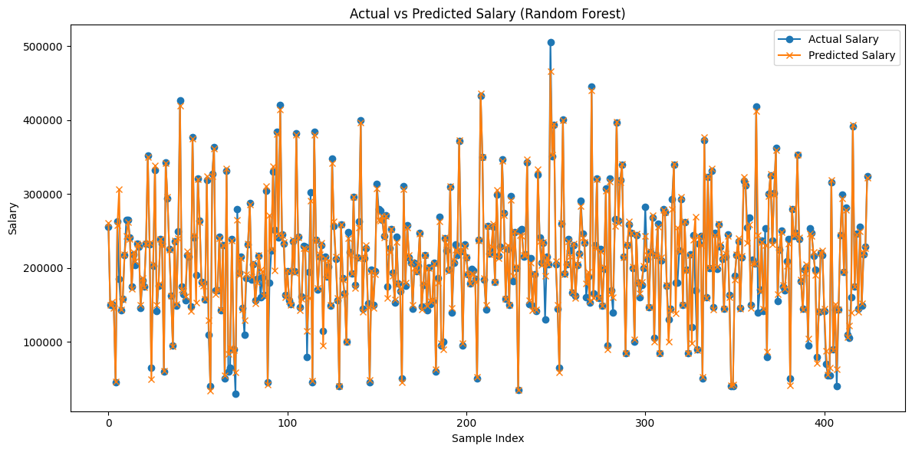
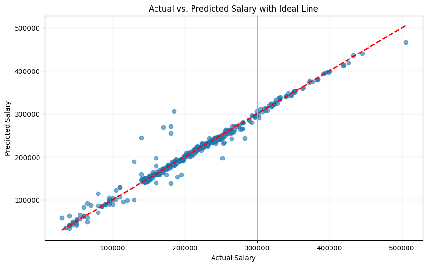

# Salary Prediction using Linear Regression

This project builds a Machine Learning model to predict employee salaries using a Kaggle dataset that includes features such as job title, experience, education level, company size, industry, and location.
The data has been cleaned, preprocessed, and encoded, and multiple regression models are trained to understand which factors influence salary.

To improve accuracy, the project implements ensemble learning techniques including:

- Random Forest Regressor

- Gradient Boosting Regressor

- Voting Regressor (combines multiple models)

Each model is evaluated using metrics like **MSE**, **RMSE**, and **R²** score, and the best-performing model is saved for future predictions.
Overall, the project demonstrates how machine learning can be used to make data-driven salary predictions using real-world job market data.

## Project Structure
- Salary_Prediction_v1.ipynb    — Main analysis and training notebook
- Salary Data.csv               — Input dataset (included in repo)
- app.py                        — Streamlit GUI
- requirements.txt              — Requirements for the project
- saved_models/                 — Directory to store the best model
- saved_encoders/               — Directory to store the best encoder
- visualizations/               — Directory to store the best ppt and visualizations
- README.md                     — This file

## Key Features
- Data cleaning and simple feature engineering
- Label encoding for categorical fields
- Multiple regressors: Linear Regression, Random Forest, Gradient Boosting
- Model ensembling with Voting Regressor
- Model evaluation (MSE, RMSE, MAE, R²)
- Best model score: 0.97(Random Forest)
- Visualizations: correlation heatmap, actual vs predicted, feature importances
- Saves best-performing model for deployment

## Dataset
The notebook contains a CSV named `Salary Data.csv` placed in the project root. The dataset includes salary and predictive features such as job title, experience, education, location, etc.

## Quickstart / Setup

From the project root:

1. Create or activate a Python environment:
   - ```python -m venv nbenv && source nbenv/bin/activate```

2. Install dependencies:
   - ```pip install -r requirements.txt```

3. Start the Streamlit app:
   - ```streamlit run app.py```
   - or open the notebook file to see model related code: `Salary_Prediction_v1.ipynb`

## Usage
- Open `Salary_Prediction_v1.ipynb` and run cells sequentially.
- The notebook:
  - Loads `Salary Data.csv`
  - Drops missing values
  - Encodes categorical columns with LabelEncoder (saves encoders as well)
  - Splits data into train/test(80/20)
  - Trains models and selects the best by R2 score
  - Saves the best model to `./saved_models` as `best_salary_model.joblib`
  - Displays evaluation metrics and plots

You can load it for inference:
```python
import joblib
model = joblib.load("./saved_models/best_salary_model.joblib")
pred = model.predict(X_new)
```

## Evaluation & Visuals
The notebook outputs:

- A summary table of model metrics (MSE, RMSE, MAE, R2)
- Correlation heatmap for feature analysis
- Actual vs Predicted plot for the best model
- Barplot comparison of R2 across models
- Feature importances for Random Forest (if trained)

<table>
   <tr>
      <td align="center"></td>
      <td align="center"></td>
   </tr>
   <tr>
      <td align="center"></td>
      <td align="center"></td>
   </tr>
</table>

## Next Steps

- Persist LabelEncoders and preprocessing pipeline (e.g., with sklearn.pipeline) to ensure consistent inference transformations.
- Perform cross-validation and hyperparameter tuning (GridSearchCV / RandomizedSearchCV).
- Expand feature engineering (text/vector features for job titles, location encoding, experience bucketing).
- Consider model explainability tools (SHAP/LIME) for feature impact analysis.


## License
- This project is licensed under the GNU General Public License v3.0 (GPL-3.0). See the LICENSE file for the full license text.
- If using third-party datasets (for example from Kaggle), ensure you comply with their license and attribution requirements; dataset licenses may differ from the project's code license.